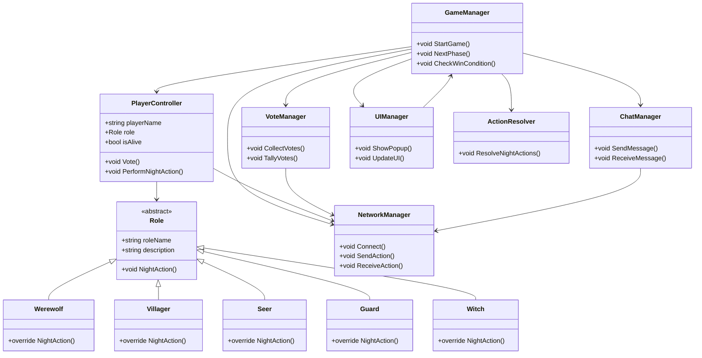

# Thiết Kế Chi Tiết Game Ma Sói Online 2D Unity

---

## 1. Sơ Đồ Class (Class Diagram)

- **GameManager**: Quản lý trạng thái game, chuyển pha ngày/đêm, kiểm tra điều kiện thắng/thua.
- **PlayerController**: Đại diện cho người chơi, lưu thông tin cá nhân, vai trò, trạng thái sống/chết.
- **Role (ScriptableObject)**: Định nghĩa các vai trò (Ma Sói, Dân Làng, Tiên Tri, Bảo Vệ, Phù Thủy, ...).
- **NetworkManager**: Quản lý kết nối, đồng bộ dữ liệu giữa các client và server.
- **VoteManager**: Xử lý logic bỏ phiếu, tổng hợp kết quả.
- **ChatManager**: Quản lý chat chung, chat riêng (Ma Sói).
- **UIManager**: Quản lý hiển thị UI, popup, thông báo.
- **ActionResolver**: Xử lý hành động ban đêm (sói cắn, bảo vệ, tiên tri, phù thủy).

---

## 2. Mô Tả Chi Tiết Vai Trò

- **Ma Sói**: . Thắng khi số sói >= số dân làBan đêm chọn nạn nhân, có thể chat riêng với sói người khác.
- **Dân Làng**: Không có kỹ năng đặc biệt, chỉ tham gia thảo luận và bỏ phiếu ban ngày.
- **Tiên Tri**: Ban đêm chọn một người để kiểm tra vai trò.
- **Bảo Vệ**: Ban đêm chọn một người để bảo vệ, không được bảo vệ 1 người 2 đêm liên tiếp.
- **Phù Thủy**: Có 1 bình cứu và 1 bình giết, ban đêm biết ai bị sói cắn và chọn cứu/giết.
- **Thợ Săn**: Nếu bị loại (bị sói cắn hoặc bị vote), được chọn một người để bắn chết cùng mình.
- **Cặp Đôi (Lover)**: Hai người được Thần Tình Yêu chọn vào đêm đầu. Nếu một người chết, người còn lại cũng chết theo (bất kể phe nào).
- **Thần Tình Yêu (Cupid)**: Đêm đầu tiên chọn hai người làm cặp đôi. Sau đó trở thành dân làng bình thường.
- **Già Làng (Old Man)**: Có nhiều mạng sống (thường là 2). Mỗi lần bị sói cắn chỉ mất 1 mạng, khi hết mạng mới chết.
- **Cô Bé (Little Girl)**: Ban đêm có thể lén xem sói chọn ai (tùy luật chơi, nếu bị phát hiện sẽ bị sói giết ngay).
- **(Có thể mở rộng thêm các vai trò khác như Thợ Săn, Cặp Đôi, ...)**

---

## 3. Flow Mạng & Logic Server-Client

### 3.1. Kết Nối
- Sử dụng Photon PUN hoặc Netcode for GameObjects.
- Server (host) quản lý logic game, client chỉ gửi lệnh (vote, chọn mục tiêu, chat).
- Tất cả thông tin nhạy cảm (vai trò, kết quả kiểm tra, mục tiêu sói) chỉ xử lý phía server.

### 3.2. Truyền Thông Tin
- **Chia vai:** Server random, gửi vai trò riêng cho từng client.
- **Hành động ban đêm:** Client gửi lựa chọn lên server, server tổng hợp và gửi kết quả về.
- **Bỏ phiếu:** Client gửi phiếu, server tổng hợp và công bố kết quả.
- **Chat:** Phân biệt chat chung (mọi người), chat sói (chỉ sói), chat lobby.

---

## 4. Chi Tiết UI

- **Main Menu:**
  - Nút tạo phòng, tham gia phòng, đăng nhập/đăng ký.
- **Lobby:**
  - Danh sách người chơi, chat phòng chờ, nút sẵn sàng.
- **Game Scene:**
  - Bàn chơi: Hiển thị avatar, tên, trạng thái sống/chết của từng người.
  - Khung chat: Chat chung, chat sói (nếu là sói).
  - Popup: Thông báo sự kiện, xác nhận hành động, kết quả bỏ phiếu.
  - Bảng vote: Hiển thị phiếu bầu, nút chọn mục tiêu.
  - Timer: Đếm ngược thời gian thảo luận, bỏ phiếu, hành động đêm.
- **End Scene:**
  - Thông báo thắng/thua, bảng vai trò, lịch sử game.

---

## 5. Luồng Trạng Thái Game

1. **Main Menu → Lobby**
2. **Lobby → Game Scene** (khi đủ người, chủ phòng bắt đầu)
3. **Game Scene:**
   - Chia vai → Ban đêm → Ban ngày (lặp lại)
   - Ban đêm: Sói, tiên tri, bảo vệ, phù thủy lần lượt thực hiện hành động
   - Ban ngày: Thảo luận, bỏ phiếu, công bố kết quả
   - Kiểm tra điều kiện thắng/thua
4. **Game Scene → End Scene** (khi kết thúc)
5. **End Scene → Main Menu/Lobby**

---

## 6. Lưu Ý Kỹ Thuật

- **Bảo mật:** Không gửi vai trò, thông tin nhạy cảm cho client không liên quan.
- **Đồng bộ:** Sử dụng RPC hoặc Custom Properties (Photon) để đồng bộ trạng thái.
- **Chống gian lận:** Logic xử lý hoàn toàn phía server, client chỉ gửi yêu cầu.
- **Tối ưu UI:** Sử dụng Canvas Group, Animator cho hiệu ứng chuyển cảnh, popup.
- **Quản lý asset:** Sử dụng Addressable hoặc Resources cho avatar, icon vai trò.
- **Kiểm thử:** Tạo các test case cho từng vai trò, trường hợp đặc biệt (bảo vệ trùng sói, phù thủy cứu/giết cùng lúc, ...).

---

## 7. Mở Rộng & Gợi Ý

- Thêm hệ thống nhiệm vụ, thành tích, bảng xếp hạng.
- Hỗ trợ chơi với AI/bot.
- Tích hợp backend lưu lịch sử, tài khoản, thống kê.
- Hệ thống bạn bè, mời phòng, chat voice.

---

## 8. Sơ Đồ Trạng Thái (State Machine)

```
stateDiagram-v2
    [*] --> MainMenu
    MainMenu --> Lobby
    Lobby --> GameScene
    GameScene --> NightPhase
    NightPhase --> DayPhase
    DayPhase --> NightPhase: Nếu chưa kết thúc
    DayPhase --> EndScene: Nếu kết thúc
    EndScene --> MainMenu
```

---

## 9. Tài Nguyên Tham Khảo
- [Photon PUN Documentation](https://doc.photonengine.com/en-us/pun/current/getting-started/pun-intro)
- [Unity Netcode for GameObjects](https://docs-multiplayer.unity3d.com/netcode/current/about/index.html)
- [Unity UI Toolkit](https://docs.unity3d.com/Manual/UI.html)

---

## 10. Sơ Đồ Class (Hình ảnh)

 <!-- Sơ đồ sẽ được bổ sung bằng Mermaid phía trên -->



---

## 11. Code Mẫu (C#)

### GameManager
```csharp
public class GameManager : MonoBehaviour {
    public List<PlayerController> players;
    public void StartGame() {
        // Chia vai trò, khởi tạo game
    }
    public void NextPhase() {
        // Chuyển pha ngày/đêm
    }
    public void CheckWinCondition() {
        // Kiểm tra điều kiện thắng/thua
    }
}
```

### PlayerController
```csharp
public class PlayerController : MonoBehaviour {
    public string playerName;
    public Role role;
    public bool isAlive = true;
    public void Vote(PlayerController target) {
        // Gửi phiếu bầu lên server
    }
    public void PerformNightAction(PlayerController target) {
        // Gửi hành động đêm lên server
    }
}
```

### Role (ScriptableObject)
```csharp
public abstract class Role : ScriptableObject {
    public string roleName;
    public string description;
    public abstract void NightAction(PlayerController self, List<PlayerController> players);
}

[CreateAssetMenu(menuName = "Roles/Werewolf")]
public class Werewolf : Role {
    public override void NightAction(PlayerController self, List<PlayerController> players) {
        // Chọn nạn nhân
    }
}
```

### NetworkManager (ví dụ với Photon)
```csharp
public class NetworkManager : MonoBehaviour {
    public void Connect() {
        PhotonNetwork.ConnectUsingSettings();
    }
    public void SendAction(string action, object data) {
        photonView.RPC("OnReceiveAction", RpcTarget.MasterClient, action, data);
    }
    [PunRPC]
    public void OnReceiveAction(string action, object data) {
        // Xử lý hành động từ client
    }
}
```

---

## 12. Flow Mạng Cụ Thể

1. **Kết nối:**
    - Client gọi `NetworkManager.Connect()` để vào server.
    - Khi đủ người, chủ phòng gọi `GameManager.StartGame()`.
2. **Chia vai:**
    - Server random vai trò, gửi riêng cho từng client.
3. **Ban đêm:**
    - Client thực hiện hành động (chọn mục tiêu), gửi lên server qua `SendAction()`.
    - Server tổng hợp, xử lý logic (ActionResolver), gửi kết quả về client.
4. **Ban ngày:**
    - Client gửi phiếu bầu lên server.
    - Server tổng hợp, công bố kết quả, cập nhật trạng thái.
5. **Đồng bộ:**
    - Mọi thay đổi trạng thái (chết, lộ vai trò, kết thúc game) đều do server xử lý và gửi về client.
6. **Chat:**
    - ChatManager gửi/nhận tin nhắn qua server, phân biệt chat chung/riêng.

--- 